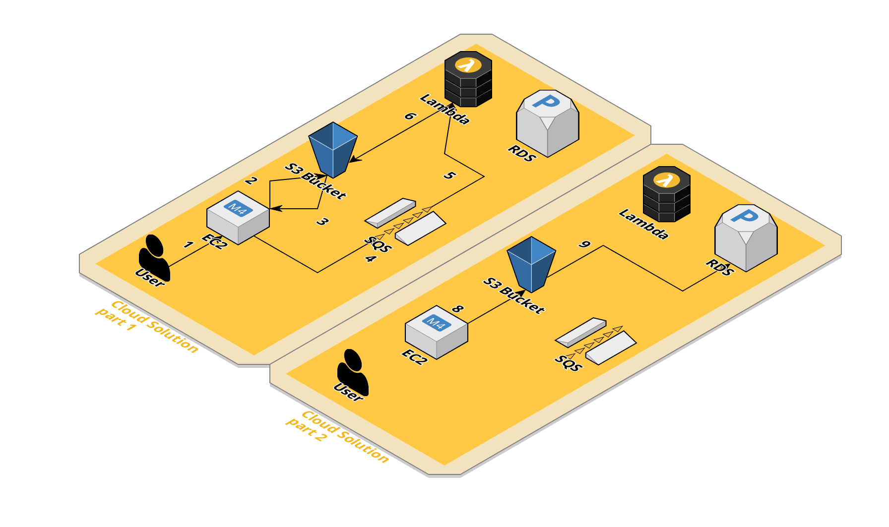

# image-resizer

[](https://github.com/blyndusk/image-resizer/releases)
[](https://github.com/blyndusk/image-resizer/commits/main)
[](https://github.com/blyndusk/image-resizer/issues)
[](https://github.com/blyndusk/image-resizer/pulls)
[](https://github.com/blyndusk/image-resizer/commits/main)
[](https://github.com/blyndusk/image-resizer/blob/main/LICENSE)
[](https://github.com/blyndusk/image-resizer)

[](https://github.com/blyndusk/image-resizer/actions/workflows/release.yml)
[](https://github.com/blyndusk/image-resizer/actions/workflows/docker.yml)

[](https://github.com/blyndusk/image-resizer/actions/workflows/vue.yml)
[](https://github.com/blyndusk/image-resizer/actions/workflows/go.yml)

- [image-resizer](#image-resizer)
  - [I - Intro](#i---intro)
    - [1 - Goal](#1---goal)
    - [2 - Stack](#2---stack)
  - [II - Schemas](#ii---schemas)
    - [1 - Local infrastructure](#1---local-infrastructure)
    - [2 - Cloud infrastructure](#2---cloud-infrastructure)
    - [3 - Database schema](#3---database-schema)
  - [III - Conventions, templates and guidelines](#iii---conventions-templates-and-guidelines)
    - [A - Commit conventions](#a---commit-conventions)
    - [B - Issue template](#b---issue-template)
    - [C - Branch naming convention](#c---branch-naming-convention)
    - [D - Pull request template](#d---pull-request-template)
  - [IV - Project use](#iv---project-use)
    - [Help](#help)
    - [Start](#start)
    - [Stop](#stop)
    - [Restart](#restart)
    - [Display logs](#display-logs)
  - [V - License](#v---license)

## I - Intro

### 1 - Goal

Image Resizer is a school project made for @ecolehetic, with the aim to automate the resize of uploaded avatar from a user on a forum.

### 2 - Stack

| Service    | Type                       |
| ---------- | -------------------------- |
| Vuejs      | Front-end framework        |
| Golang     | Back-end language          |
| PostgresQL | Object-relational database |
| RabbitMQ   | Message broker             |

## II - Schemas

### 1 - Local infrastructure


### 2 - Cloud infrastructure




### 3 - Database schema


## III - Conventions, templates and guidelines

### A - Commit conventions

```
tag(scope): #issue_id - message
```

See [commit_conventions.md](.github/commit_conventions.md) for more informations.

### B - Issue template

See [user-story.md](.github/ISSUE_TEMPLATE/user-story.md) for more informations.

### C - Branch naming convention

```
type_scope-of-the-work
```

See [branch_naming_convention.md](.github/branch_naming_convention.md) for more informations.

### D - Pull request template

See [pull_request_template.md](.github/pull_request_template.md) for more informations.


## IV - Project use

### Help

```bash
$ make help
```

### Start

```bash
$ make start
```

### Stop

```bash
$ make start
```

### Restart

```bash
$ make restart
```

### Display logs

```bash
$ make logs
```

## V - License

Under [MIT](./LICENSE) license.
